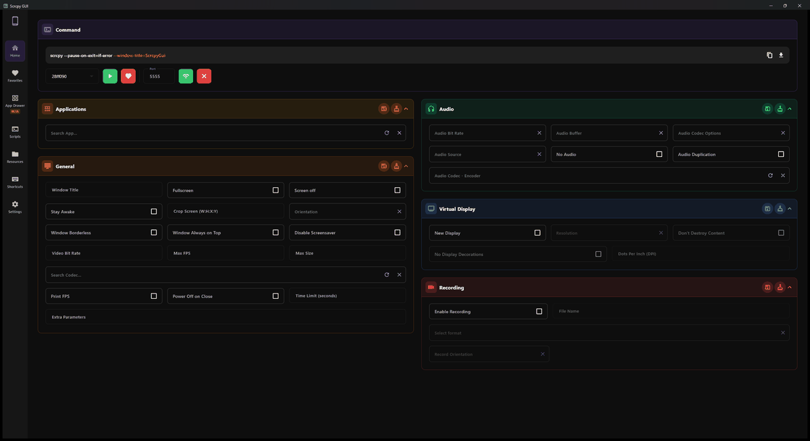
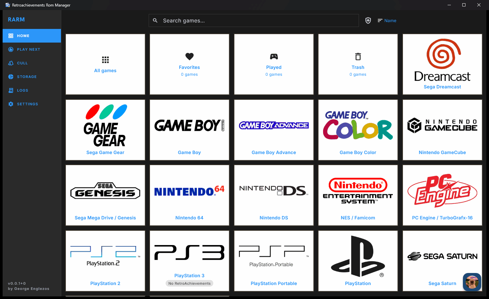

  <h1>George Englezos</h1>
  <h3>Full-Stack Software Engineer</h3>
  

    
    
  

  

---

### 👨‍💻 About Me

- 🎓 **BSc in Informatics & Telematics** – Harokopio University, Athens
- 💻 Full-stack engineer working across **.NET** on the backend and **Angular / React** on the frontend
- 🎮 App and game development is my hobby: cross-platform apps with **Flutter** and mini games in **Unity**, some published on [itch.io](https://judge-g.itch.io/)
- 📫 Reach me at **englezosgiorgos@gmail.com**

---

### 🏆 Personal Projects

- 🖥️ **[Scrcpy-GUI](https://github.com/GeorgeEnglezos/Scrcpy-GUI)** *(Flutter)* – Desktop app that makes `scrcpy` easy to use.  ⭐ 450+ GitHub stars · featured in Android emulation and dev communities
- 🌐 **[scrcpy-ui.web.app](https://scrcpy-ui.web.app/)** *(Angular)* – Web version of the desktop app (work in progress). Import packages, codecs, and commands for the full experience. No login required; everything is saved locally in the browser.
- 🎯 **[RetroAchievements ROM Manager](https://github.com/GeorgeEnglezos/retroachievements-rom-manager)** *(Flutter)* – Scans your local ROM library and tracks your RetroAchievements progress, achievement counts, and completion.
- 🛸 **[Stellaroid](https://judge-g.itch.io/stellaroid)** *(Unity)* – A small arcade game demo published on itch.io.

  <table>
    <tr>
      <td align="center" width="50%">
         
        <em>Scrcpy-GUI</em>
      </td>
      <td align="center" width="50%">
         
        <em>RetroAchievements ROM Manager</em>
      </td>
    </tr>
  </table>

---

### 🧠 Tech Stack

**Languages & Frameworks**

  
  
  
  
  
  
  
  
  
  

**Databases**

  
  

**Tools & Platforms**

  
  
  

**App & Game Dev** *(hobby)*

  
  
  

---
